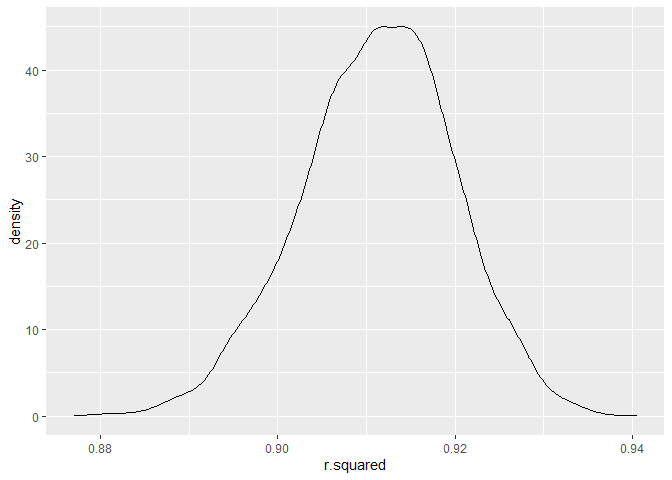

Homework 6
================
Wenhao Gou
2020/12/8

## Question 1:

### Clean and tidy the dataset:

Firstly, create and clean the dataset we need to use in further
analysis:

``` r
homicide_clean = 
  read_csv("data/homicide-data.csv", na = c("", "NA", "Unknown")) %>% 
  mutate(
    city_state = str_c(city, state, sep = ", "),
    victim_age = as.numeric(victim_age),
    resolution = case_when(
      disposition == "Closed without arrest" ~ 0,
      disposition == "Open/No arrest"        ~ 0,
      disposition == "Closed by arrest"      ~ 1)
  ) %>% 
  filter(
    victim_race %in% c("White", "Black"),
    city_state != "Tulsa, AL",
    city_state != "Dallas, TX",
    city_state != "Phoenix, AZ",
    city_state != "Kansas City, MO") %>% 
  select(city_state, resolution, victim_age, victim_race, victim_sex)
```

### Logsictic regression on Baltimore, MD

``` r
model_Baltimore <-
  homicide_clean %>% 
  filter(city_state == "Baltimore, MD") %>% 
  glm(resolution ~ victim_age + victim_race + victim_sex, 
      data = .,
      family = binomial())  
  
result_Baltimore <- 
  model_Baltimore %>% 
  broom::tidy() %>% 
  mutate(
    odd_ratio = exp(estimate),
    CI_lower = exp(estimate - 1.96 * std.error),
    CI_upper = exp(estimate + 1.96 * std.error)
  ) %>% 
  select(term, odd_ratio , starts_with("CI")) %>% 
  knitr::kable(digits = 3)
```

### Logistic regression on all cities:

``` r
result_all <-
  homicide_clean %>% 
  nest(glm_data = -city_state) %>% 
  mutate(model = map(.x =glm_data, ~glm(resolution ~ victim_age + victim_race + victim_sex, 
                                   data =.x,
                                   family = binomial())),
         result = map(model,broom::tidy)) %>% 
  select(city_state, result) %>% 
  unnest(result) %>% 
  mutate(
    odd_ratio = exp(estimate),
    CI_lower = exp(estimate - 1.96 * std.error),
    CI_upper = exp(estimate + 1.96 * std.error)
  ) %>% 
  select(city_state, term, odd_ratio, starts_with("CI")) 
```

### Plots of odd ratio and CIs:

``` r
result_all %>% 
  filter(term == "victim_sexMale") %>% 
  mutate(city_state = fct_reorder(city_state, odd_ratio )) %>% 
  ggplot(aes(x = city_state, y = odd_ratio)) + 
  geom_point() + 
  geom_errorbar(aes(ymin = CI_lower, ymax = CI_upper)) + 
  theme(axis.text.x = element_text(angle = 90, hjust = 1))
```

<!-- -->

## Quesiton 2:

### Import and tidy the data

``` r
#Read and clean the data:
child_df <-
  read_csv("./data/birthweight.csv") %>% 
  mutate(babysex = as.factor(babysex),
         frace = as.factor(frace),
         mrace = as.factor(mrace),
         malform = as.factor(malform))

#Check and initial explore of the dataset
skimr::skim(child_df) 
```

|                                                  |           |
| :----------------------------------------------- | :-------- |
| Name                                             | child\_df |
| Number of rows                                   | 4342      |
| Number of columns                                | 20        |
| \_\_\_\_\_\_\_\_\_\_\_\_\_\_\_\_\_\_\_\_\_\_\_   |           |
| Column type frequency:                           |           |
| factor                                           | 4         |
| numeric                                          | 16        |
| \_\_\_\_\_\_\_\_\_\_\_\_\_\_\_\_\_\_\_\_\_\_\_\_ |           |
| Group variables                                  | None      |

Data summary

**Variable type: factor**

| skim\_variable | n\_missing | complete\_rate | ordered | n\_unique | top\_counts                     |
| :------------- | ---------: | -------------: | :------ | --------: | :------------------------------ |
| babysex        |          0 |              1 | FALSE   |         2 | 1: 2230, 2: 2112                |
| frace          |          0 |              1 | FALSE   |         5 | 1: 2123, 2: 1911, 4: 248, 3: 46 |
| malform        |          0 |              1 | FALSE   |         2 | 0: 4327, 1: 15                  |
| mrace          |          0 |              1 | FALSE   |         4 | 1: 2147, 2: 1909, 4: 243, 3: 43 |

**Variable type: numeric**

| skim\_variable | n\_missing | complete\_rate |    mean |     sd |      p0 |     p25 |     p50 |     p75 |   p100 | hist  |
| :------------- | ---------: | -------------: | ------: | -----: | ------: | ------: | ------: | ------: | -----: | :---- |
| bhead          |          0 |              1 |   33.65 |   1.62 |   21.00 |   33.00 |   34.00 |   35.00 |   41.0 | ▁▁▆▇▁ |
| blength        |          0 |              1 |   49.75 |   2.72 |   20.00 |   48.00 |   50.00 |   51.00 |   63.0 | ▁▁▁▇▁ |
| bwt            |          0 |              1 | 3114.40 | 512.15 |  595.00 | 2807.00 | 3132.50 | 3459.00 | 4791.0 | ▁▁▇▇▁ |
| delwt          |          0 |              1 |  145.57 |  22.21 |   86.00 |  131.00 |  143.00 |  157.00 |  334.0 | ▅▇▁▁▁ |
| fincome        |          0 |              1 |   44.11 |  25.98 |    0.00 |   25.00 |   35.00 |   65.00 |   96.0 | ▃▇▅▂▃ |
| gaweeks        |          0 |              1 |   39.43 |   3.15 |   17.70 |   38.30 |   39.90 |   41.10 |   51.3 | ▁▁▂▇▁ |
| menarche       |          0 |              1 |   12.51 |   1.48 |    0.00 |   12.00 |   12.00 |   13.00 |   19.0 | ▁▁▂▇▁ |
| mheight        |          0 |              1 |   63.49 |   2.66 |   48.00 |   62.00 |   63.00 |   65.00 |   77.0 | ▁▁▇▂▁ |
| momage         |          0 |              1 |   20.30 |   3.88 |   12.00 |   18.00 |   20.00 |   22.00 |   44.0 | ▅▇▂▁▁ |
| parity         |          0 |              1 |    0.00 |   0.10 |    0.00 |    0.00 |    0.00 |    0.00 |    6.0 | ▇▁▁▁▁ |
| pnumlbw        |          0 |              1 |    0.00 |   0.00 |    0.00 |    0.00 |    0.00 |    0.00 |    0.0 | ▁▁▇▁▁ |
| pnumsga        |          0 |              1 |    0.00 |   0.00 |    0.00 |    0.00 |    0.00 |    0.00 |    0.0 | ▁▁▇▁▁ |
| ppbmi          |          0 |              1 |   21.57 |   3.18 |   13.07 |   19.53 |   21.03 |   22.91 |   46.1 | ▃▇▁▁▁ |
| ppwt           |          0 |              1 |  123.49 |  20.16 |   70.00 |  110.00 |  120.00 |  134.00 |  287.0 | ▅▇▁▁▁ |
| smoken         |          0 |              1 |    4.15 |   7.41 |    0.00 |    0.00 |    0.00 |    5.00 |   60.0 | ▇▁▁▁▁ |
| wtgain         |          0 |              1 |   22.08 |  10.94 | \-46.00 |   15.00 |   22.00 |   28.00 |   89.0 | ▁▁▇▁▁ |

``` r
#Check the levels of factors:
unique(pull(child_df, babysex))
```

    ## [1] 2 1
    ## Levels: 1 2

``` r
unique(pull(child_df, frace))
```

    ## [1] 1 2 3 4 8
    ## Levels: 1 2 3 4 8

``` r
unique(pull(child_df, mrace))
```

    ## [1] 1 2 3 4
    ## Levels: 1 2 3 4

``` r
unique(pull(child_df, malform))
```

    ## [1] 0 1
    ## Levels: 0 1

We can see that, there are no missing data in the dataset. From the
glance of the data, focus on the continuous variable, we can see that
all the data entry in the variable `pnumlbw` (previous number of low
birth weight babies) and `pnumsga` (number of prior small for
gestational age babies) are zero, so we can drop these two variables.
For some variable that is highly skewed, like `parity` (number of live
births prior to this pregnancy) and `smoken` (average number of
cigarettes smoked per day during pregnancy), it may not be appropriate
to include the main model or should be treated as factors.

For discreet variables, we checked the level of them. Also, the variable
`malform` is highly skewed and may not be appropriate to included in the
meta analysis.

### Model building:

As the description above, we would like to use all the remaining
variables. Also, some transformation need to be done. Then, we apply an
AIC framework to select the most important variables. Also, as mothers
race and fathers race are highly correlated, fathers race was droped in
the model.

``` r
child_df_modeldata <-
  child_df %>% 
  select(-pnumlbw,-pnumsga,-parity,-smoken,-malform, -frace) %>%
  mutate(momage = log(momage),
         ppbmi = log(ppbmi),
         ppwt = log(ppwt),
         delwt = log(delwt)) 

child_model_1 <-  lm(bwt~., data = child_df_modeldata)
```

``` r
child_model_2 <- step(child_model_1, direction = "backward")
```

``` r
summary(child_model_2)
```

    ## 
    ## Call:
    ## lm(formula = bwt ~ babysex + bhead + blength + fincome + gaweeks + 
    ##     mrace + ppbmi + ppwt + wtgain, data = child_df_modeldata)
    ## 
    ## Residuals:
    ##      Min       1Q   Median       3Q      Max 
    ## -1077.71  -183.24    -3.52   176.45  2418.55 
    ## 
    ## Coefficients:
    ##               Estimate Std. Error t value Pr(>|t|)    
    ## (Intercept) -6840.6817   156.0266 -43.843  < 2e-16 ***
    ## babysex2       32.7238     8.5087   3.846 0.000122 ***
    ## bhead         132.7203     3.4665  38.286  < 2e-16 ***
    ## blength        76.2564     2.0277  37.608  < 2e-16 ***
    ## fincome         0.3451     0.1760   1.960 0.050051 .  
    ## gaweeks        10.8256     1.4678   7.375 1.95e-13 ***
    ## mrace2       -117.7245     9.6395 -12.213  < 2e-16 ***
    ## mrace3        -46.4174    42.6136  -1.089 0.276099    
    ## mrace4        -86.2531    19.4000  -4.446 8.97e-06 ***
    ## ppbmi        -176.9533    57.3841  -3.084 0.002058 ** 
    ## ppwt          363.9890    52.1761   6.976 3.49e-12 ***
    ## wtgain          3.9560     0.3943  10.034  < 2e-16 ***
    ## ---
    ## Signif. codes:  0 '***' 0.001 '**' 0.01 '*' 0.05 '.' 0.1 ' ' 1
    ## 
    ## Residual standard error: 274.5 on 4330 degrees of freedom
    ## Multiple R-squared:  0.7134, Adjusted R-squared:  0.7127 
    ## F-statistic: 980.1 on 11 and 4330 DF,  p-value: < 2.2e-16

``` r
child_newmodel <- lm(bwt ~  babysex + bhead + blength + 
                       fincome + gaweeks + mrace + 
                       log(ppbmi) + log(ppwt) + wtgain,
                     data=child_df)
```

So, our final model will be:

bwt = b0 + b1 \* babysex+b2 \* bhead+b3 \* blength+b4 \* fincome+b5 \*
gaweeks+b6 \* mrace + b7 \* log(ppbmi)+b8 \* wtgain

``` r
child_df %>% 
  add_residuals(child_newmodel) %>% 
  add_predictions(child_newmodel) %>% 
  ggplot(aes(x = pred, y = resid)) +
  geom_point(alpha = 0.3) +
  stat_smooth(method = "lm")
```

<!-- -->

### Cross Validation:

``` r
cv_df =
  crossv_mc(child_df,100) %>% 
  mutate(
    new_model = map(.x = train, ~lm(bwt ~  babysex + bhead + blength + 
                                      fincome + gaweeks + mrace + 
                                      log(ppbmi) + log(ppwt) + wtgain,
                                    data = .x)),
    old_model_1 = map(.x = train, ~lm(bwt~ gaweeks + blength, data = .x)),
    old_model_2 = map(.x = train, ~lm(bwt~ bhead * blength * babysex, data = .x))
  ) %>% 
  mutate(
    rmse_new = map2_dbl(.x = new_model, .y = test, ~rmse(model = .x, data = .y)),
    rmse_old_1 = map2_dbl(.x = old_model_1, .y = test, ~rmse(model = .x, data = .y)),
    rmse_old_2 = map2_dbl(.x = old_model_2, .y = test, ~rmse(model = .x, data = .y))
  ) 
  
plot <-
  cv_df %>% 
  select(starts_with("rmse")) %>% 
  pivot_longer(
    everything(),
    names_to = "model",
    values_to = "rmse",
    names_prefix = "rmse_"
  ) %>% 
  ggplot(aes(x = model, y = rmse)) +
  geom_violin()

plot
```

<!-- -->

## Question 3:

### Get the dataaset:

``` r
# I stroed the data in this repository:

#weather_df =
#  rnoaa::meteo_pull_monitors(
#  c("USW00094728"),
#  var = c("PRCP", "TMIN", "TMAX"),
#  date_min = "2017-01-01",
#  date_max = "2017-12-31") %>%
#  mutate(
#  name = recode(id, USW00094728 = "CentralPark_NY"),
#  tmin = tmin / 10,
#  tmax = tmax / 10) %>%
#  select(name, id, everything())
#weather_df %>% 
#  write_csv("./data/weather.csv")

weather_df <- read_csv("./data/weather.csv")
```

### Boostraping

``` r
bootstraping_df <-
  weather_df %>%
  select(tmax, tmin) %>% 
  bootstrap(5000, id = "sample_id") %>% 
  mutate(model = map(.x = strap, ~lm(tmax~. ,data = .x)),
         result = map(model, broom::tidy),
         rsquare = map(model, broom::glance)) %>% 
  select(sample_id, result, rsquare) %>% 
  unnest(result, rsquare) 

bootstraping_result <-
  bootstraping_df %>% 
  select(sample_id, term, estimate, r.squared)
```

### Distribution of estimated r-sqarue:

``` r
bootstraping_result %>% 
  select(sample_id, r.squared) %>% 
  distinct(sample_id, .keep_all = T) %>% 
  ggplot(aes(x = r.squared)) +
  geom_density()
```

<!-- -->

Comment: From the plot, we can see that, the distribution of the
r.square is not exactly normal distributed and is slightly left-skewed.
This indicate that some of the assumption of the linear regression may
violated (e.g. normal distribution of the estimators)

### Distribution of log term:

``` r
bootstraping_result %>% 
  select(sample_id, term, estimate) %>% 
  mutate(term = str_replace(term, "\\(Intercept\\)", "intercept")) %>% 
  pivot_wider(names_from = term,
              values_from = estimate) %>% 
  mutate(logterm = log(intercept * tmin)) %>% 
  ggplot(aes(x = logterm)) +
  geom_density()
```

<!-- -->

Comment: From the plot, again, we can see that, the distribution of the
the log term is not exactly normal distributed and is slightly
left-skewed. This indicate that some of the assumption of the linear
regression may violated (e.g. normal distribution of the estimators)

### Confidential intervals and quantiles

``` r
bootstraping_result %>% 
  mutate(term = str_replace(term, "\\(Intercept\\)", "intercept")) %>% 
  pivot_wider(names_from = term,
              values_from = estimate) %>% 
  mutate(logterm = log(intercept * tmin)) %>% 
  select(sample_id, r.squared, logterm) %>% 
  pivot_longer(-sample_id,
               values_to = "value",
               names_to = "term") %>% 
  group_by(term) %>% 
  summarise(CI_lower = quantile(value, 0.025), 
            CI_upper = quantile(value, 0.975))
```

    ## # A tibble: 2 x 3
    ##   term      CI_lower CI_upper
    ##   <chr>        <dbl>    <dbl>
    ## 1 logterm      1.97     2.06 
    ## 2 r.squared    0.894    0.927
